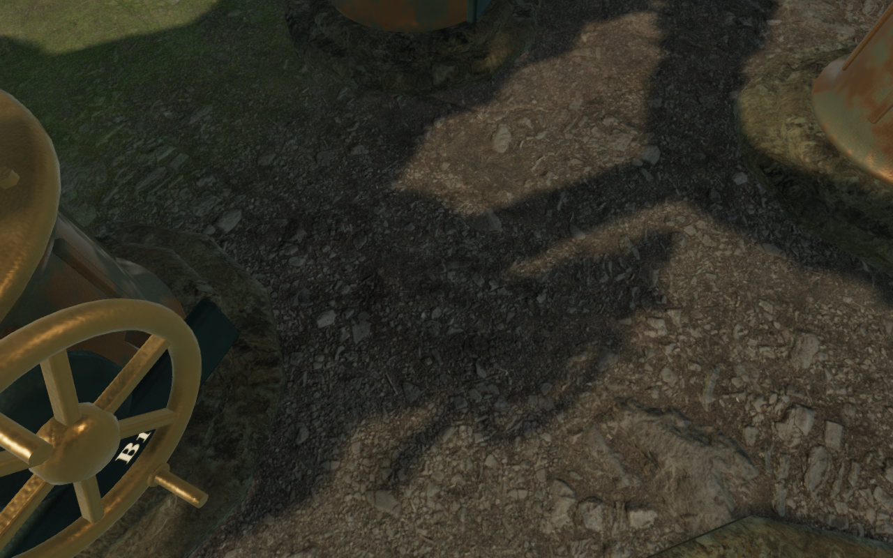
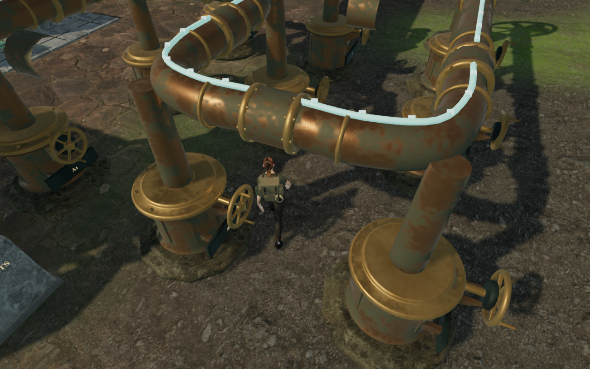
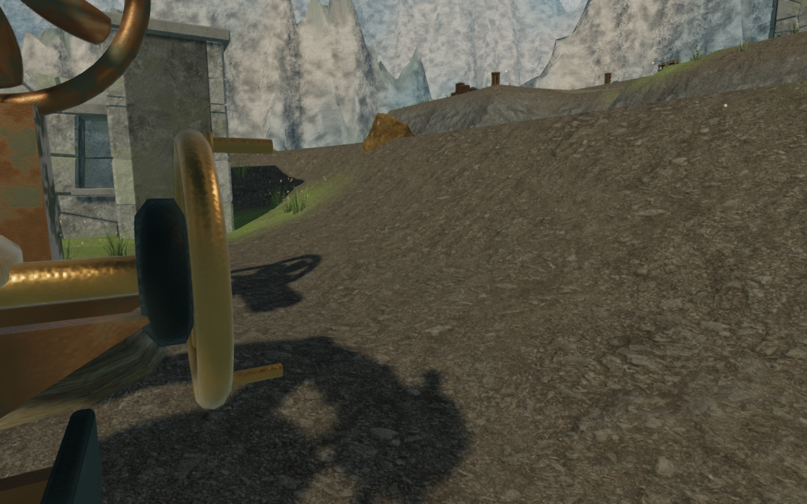
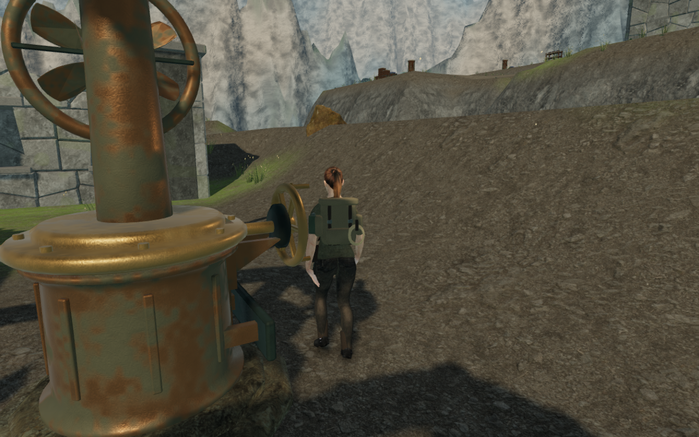
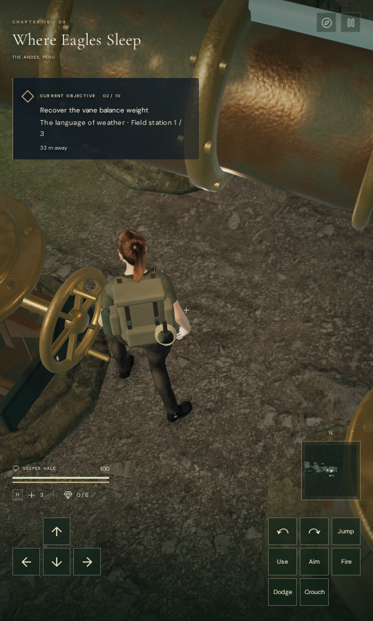

# Walking views beside wind machinery

The later [puzzle-pillar walking-camera pass](counterweight-walking-camera.md)
extends this recovery to ordinary walking across the campaign and clears the
fifteen remaining fades on the recorded complete cloud-engine route. The
verification below records this earlier wind-scoped milestone.

Returning through the first cloud forecourt could hide the explorer beneath an
overhead coupling. The last observatory wheel's approach also passed close to
wind castings, briefly retracting the camera before its working view recovered.
The earlier [board-view pass](counterweight-overview.md) cleared recorded stone
approaches, while these wind-machinery views remained open as VA-46 and VA-39.

The follow camera now checks nearby clearance when a wind-court view would become
short. It searches a bounded range of 0.3 radians in yaw and 0.4 in pitch, using
the same registered solids, terrain and body-sight checks. Clear ordinary views
retain normal follow. If a thin shaft blocks the smoothed path as well, contact
resolves immediately while preserving as much of the previous camera separation
as the clear orbit allows. The original wall and close-view behavior remains
when no nearby clear orbit fits.

This displaces the camera for collision response; it does not rewrite the
player's yaw, pitch, walking position or saved puzzle state. Aimed, water,
climbing, rope and cable views retain their existing follow behavior. No world
geometry, mechanism rules, save format or audio behavior changes.

## Verification

A **745-test campaign run passes**. After the final contact-distance refinement,
all **17 focused camera checks pass**, including three new tests covering an
actual cylindrical coupling, retained player/look state, excluded view modes
and a wall that closes every nearby orbit. Substituting the earlier ordinary
follow function makes the coupling regression fail its character-clearance
assertion. The final production build and JavaScript formatting pass, with the
existing bundle-size advisory. The full campaign run began before that final
distance refinement; the focused tests and all final browser checks cover it.

Two continuous assisted sequences start with earlier earned saves: the first
engine's activated forecourt return, and the remaining observatory wind turns
from its ninth-duct approach save. They record **1,306 camera frames**:

| Sequence | Camera frames | Earlier faded frames | Earlier minimum arm | Updated minimum arm |
| --- | ---: | ---: | ---: | ---: |
| Forecourt return | 429 | 56 | 1.330 m | 3.364 m |
| Observatory approaches and turns | 877 | 21 | 0.382 m | 3.230 m |

Updated character opacity remains 1 throughout both sequences. Every recorded
foot position, yaw and pitch agrees exactly with the baseline. The largest
frame-to-frame camera move on the return falls from 3.237 m to **0.657 m**; in
the observatory it falls from 3.770 m to **2.405 m**. Some collision corrections
remain immediate, so this does not establish uniformly smooth camera motion.
All **26 baseline and 26 final captures** are reviewed. Shaders link and the
completed runs report no browser errors or console warnings. Opacity coverage
does not mean every body pixel is unobscured by foreground objects.

The complete first-engine route also repeats **192.687 m over 3,410 controller
ticks**, reading the tablet, solving all 14 stone moves, operating and activating
the engine, then returning through the chamber to the inscription. Health stays
100, no route stalls, and the largest ground step is 6.7 cm. All **64 captures**
are reviewed. The recorded coupling return now has a **5.010 m** moving arm,
compared with 1.362 m before this change. The final tablet view reaches 5.462 m.

This wider frame review still finds **15 brief faded frames in five inter-stone
approach episodes**, with a shortest arm of 0.798 m. Those positions lie inside
the board, outside the wind-camera adjustment area. They remain part of VA-46;
the complete route is not continuously clear. Assisted route steering and
solutions do not establish an unassisted playthrough or device performance.

Four native production cases cover keyboard High and portrait touch Low at the
forecourt coupling and observatory wheel. Real look input restores earlier
obstructed headings; both wheel cases complete one physical quarter-turn. All
cases accept subsequent look input and preserve those chosen angles while
walking. Net walking distances are **1.80 m, 2.40 m, 1.48 m and 2.02 m**, with
health 100. All **16 native captures** are reviewed. The development hook is
absent, no asset requests fail, portrait pages have no horizontal overflow, and
loaded bundle filenames match the final build. No browser errors or console
warnings are recorded.

Reload preserves the complete saved store apart from `lastPlayed` and three
existing arrival-camera corrections. Independent actual-world queries measure
the earlier raw saved orbits at **1.491 m, 0.726 m and 1.347 m**, and the selected
orbits at **5.474 m, 5.330 m and 5.330 m**. Each matches the ordinary arrival
selector, changing yaw by 15 degrees with pitch retained. Second reloads preserve
the complete store apart from timestamps. Restored feet agree within 5 cm, and
health, machinery, field work, discoveries and chapter progress remain intact.

The verified production files are `index-CJxScDN1.js`, `game-BUHHfM13.js`,
`three-mu_AYolc.js` and `index-CQBT4VmC.css`.

## Remaining scope and provenance

VA-39 is repaired for the recorded observatory approach and working sequence.
VA-46's recorded wind-coupling return is clear, while the additional free board
approaches remain open. Arbitrary camera inputs, wider chapter composition,
repeated scenery, supported-device performance and subjective audio review
still need work.

The camera adjustment and regressions are original project code. Existing
credited artwork, distance-sensitive sounds and quiet chapter/objective scores
are retained; no external asset or dependency was added. The five documentation
images are actual game captures converted losslessly to WebP, with decoded RGBA
identity verified. Saves, raw captures, logs and browser profiles remain in
ignored workspace-local staging.
