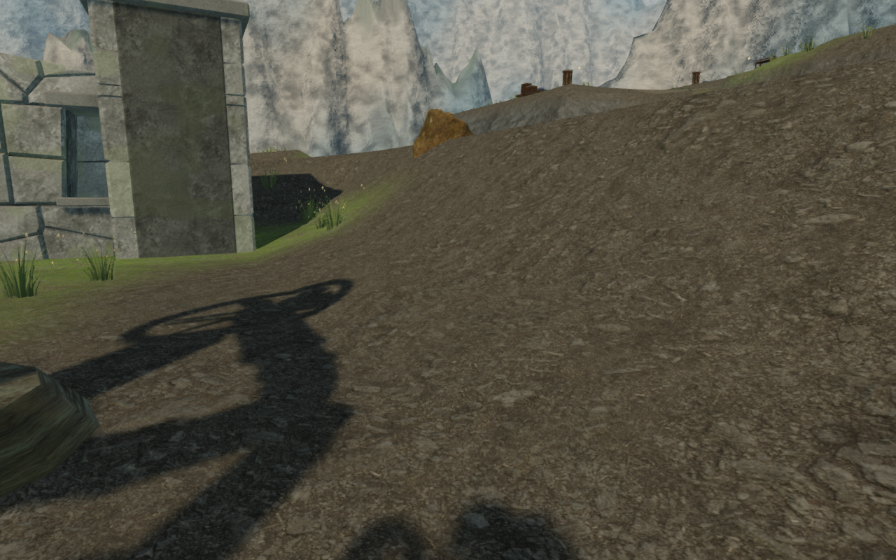
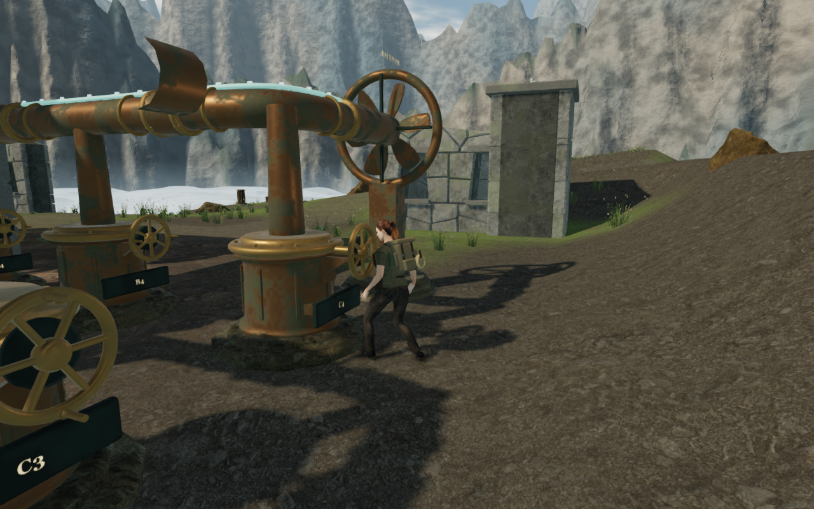
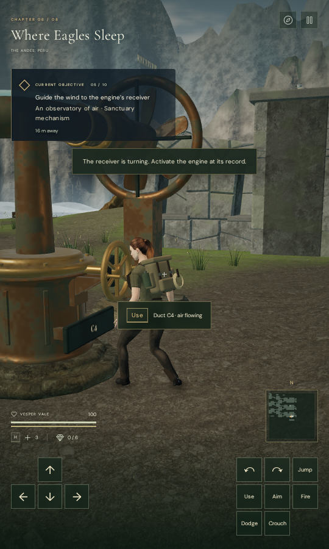
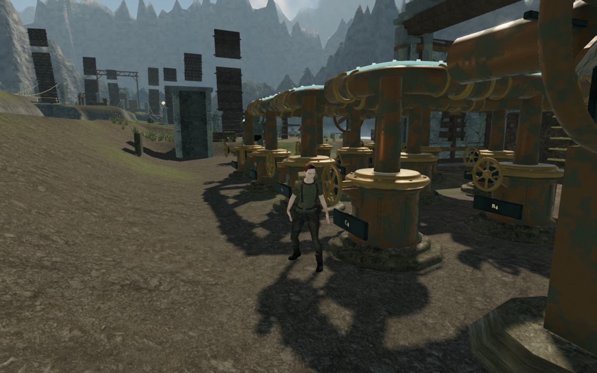

# Framing physical wind-wheel turns

The fifth wind engine's final duct could hide the explorer after a successful
turn. At the earned approach heading, a peg rotating through chest height
retracted the camera into its look point. The recorded camera arm reached
0.205 m and the explorer's close-camera coverage reached zero. Terrain filled
the resulting view, but terrain samples confirmed that it did not obstruct
this camera arm.

An accepted wheel interaction now selects a view on the working side of the
pegs. It checks terrain, machinery bounds and the sight line to the explorer's
chest, prefers nearby headings, and retains a clear rear heading. The existing
swept follow camera eases toward that view. The selection runs once when Use
starts an operation; subsequent mouse, keyboard and touch look input remains
available. Rejected or overlapping interactions do not change the view.

The repeated route's final-turn camera arm measures 5.374 m to the explorer's
chest. These before/after images come from separate continuous assisted runs
of the same route. Their camera headings intentionally differ.

## Verification

- All **729 tests pass across two batches**. The broad remaining batch passes
  728 tests; the dedicated guided-view regression passes separately. An earlier
  combined run was interrupted before completion and is not counted as a pass.
  The production build succeeds with the existing large chunk advisory.
- The new regression covers all **110 working wheels** from two reverse
  headings and a rear heading, with feet just inside the direct-turn tolerance.
  Four legal turns at three motion samples produce **3,960 camera checks**.
  The minimum constrained arm to the shifted look point is **5.330 m**.
  Camera occupancy, casting and chest sight lines remain clear, and controller
  feet remain unchanged. Rejected turns and later look input have separate
  regression checks.
- The continuous assisted observatory route loads its previously earned
  fifth-sector save once. It recovers the pendulum, crosses both damaged spans,
  surveys the mount, installs the component, turns fourteen ducts and activates
  the fifth engine. It reaches stage 5 with health 100 over **323.551 m and
  5,749 player updates**, with a largest step of **0.216 m**, no steps over one
  metre and no stalls. All **57 captures** are reviewed. The delivered player,
  camera and machinery advance under scripted steering; enemy AI and combat
  are not advanced.
- A separate observer replay restores the recorded obstructed approach camera
  once, then performs the ordinary interaction and samples 100 controller,
  machinery and camera updates. After Use, its smallest arm to the chest is
  **1.723 m** on the first update; explorer coverage becomes full on the third
  update, or 0.05 seconds at the fixed inspection step. The remaining samples
  retain full coverage and clear rays. This replay checks the transition from
  the old view and is not an additional continuous traversal.
- **36 reviewed High/Low observers** show a working wheel in each of all nine
  engines from both reverse headings. The actual saved quality, shadow and
  cinematic settings are checked. Every view has a legal standing position,
  full explorer coverage, a clear chest sight line and a linked shader program.
  These are assigned observer positions on disposable progress. The optional
  guided mode of [inspect-wind-camera-browser.js](../scripts/inspect-wind-camera-browser.js)
  provides the reusable setup and measurements.
- Four production cases use earned saves at engine index 4, duct 11 and engine
  index 2, duct 6. Native mouse or touch gestures reproduce the adverse heading;
  native keyboard or touch Use turns the wheel exactly once. A further look
  gesture changes the heading by 0.16 radians, and ordinary movement covers
  0.311–0.461 m. The complete localStorage record reloads exactly apart from
  `lastPlayed`; resumed feet stay within 5 cm and wind, field progress and
  health remain intact. All **24 native views** are reviewed at 1280 × 800 High
  and 540 × 900 Low. The cases load the current production assets without a
  development game handle or page overflow.
- Final browser runs report no errors or warnings. The four documentation
  images are actual game captures converted losslessly to WebP, with decoded
  RGBA identity checked.

## Remaining review

At this milestone, the turning view is repaired. The preceding approach still
has a 1.348 m arm and can hide the explorer; general reverse and approach
framing remains open. Starting a turn from that close view still fades the
explorer during its first two recovery updates.

The later [wind walking-camera repair](wind-walking-camera.md) clears the
recorded observatory approach and working sequence across 877 camera frames,
with identical walking feet and saved look angles. Its broader first-engine
route still records brief free stone-board fades for further review.

The observer review also exposed distant stone-like fragments suspended
above later cloud-city courts. The subsequent [folding deck repair](bridge-deck-frames.md)
identifies them as raised timber bridge halves and adds continuous structural
frames. The image below retains the earlier construction for comparison.

The [broader visual audit](visual-audit.md) remains active, including later
routes, repeated courtyards, terrain shoulders, other chamber interiors and
custom component handling. Existing positioned environmental and mechanism
sounds and chapter/objective music remain in use. This pass adds no listening
assessment, consumer hardware benchmark or AAA graphics claim.
