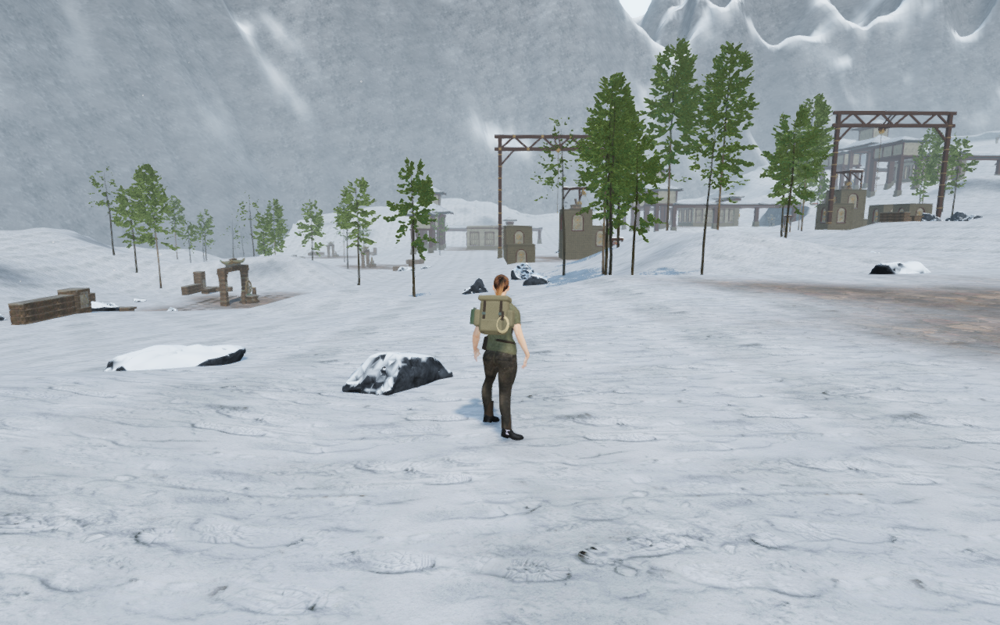
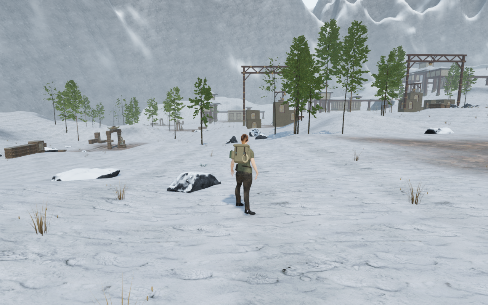
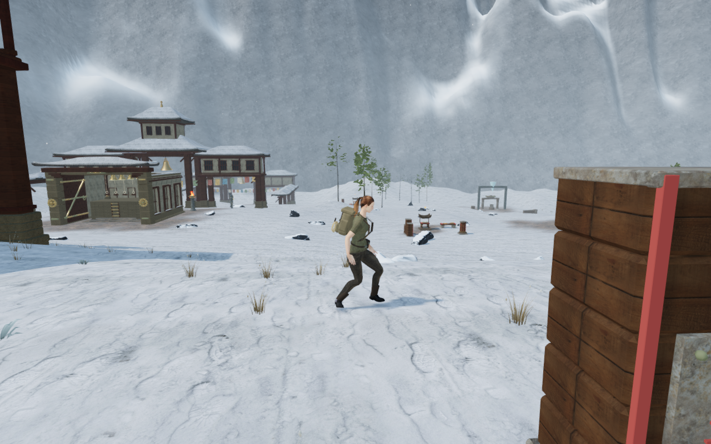
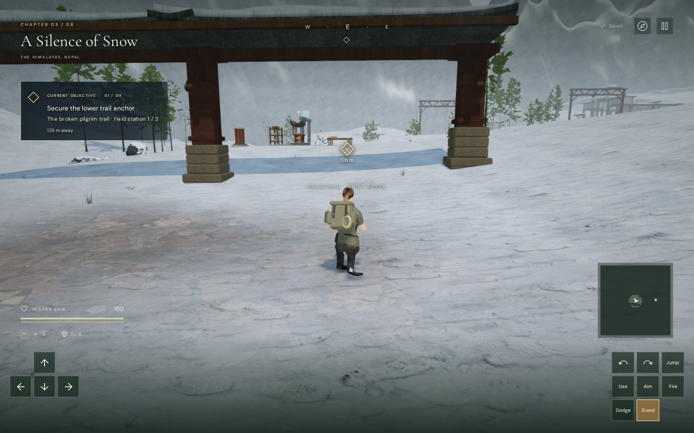
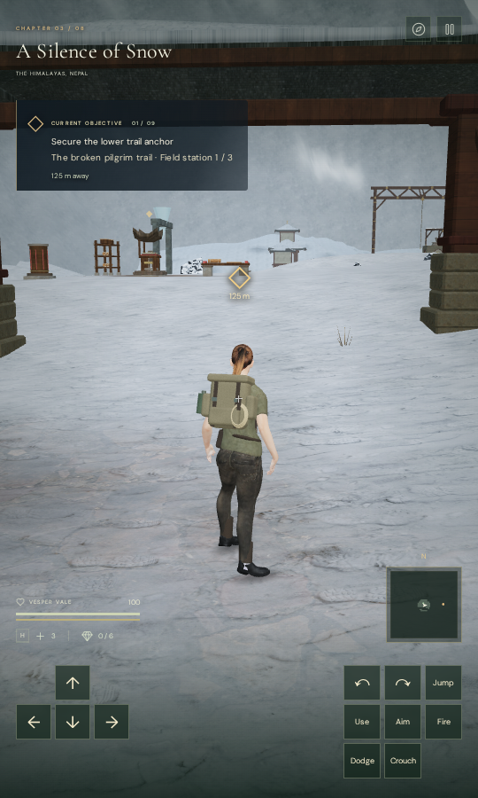

# Winter grass beside the monastery routes

**A Silence of Snow** now has pockets of dormant bunchgrass, taller seed-bearing
stems and low frost-covered cushions beside its routes. The pale brown stems
break up previously empty snow; their exposed ends carry a cool frost tint.
Trail centres and working positions remain clear.

| Previous early-court foreground | Winter cover at the same camera |
| --- | --- |
|  |  |

The three specimens adapt the project's original folded meadow leaves. Each
has 24 leaves and three detail tiers, with fewer curve segments and stable
roots, tips and seed heads. Colour gradients place frost on the upper parts of
the actual leaf mesh. A restrained wind bends the upper leaves while their
roots stay fixed. No external model, texture, recording or dependency is added.
The cloud and observatory specimens retain their original default parameters.

The deterministic layout has **5,718 plants**: 2,557 short bunchgrasses, 2,280
taller seed-bearing specimens and 881 cushions. Broad noise shapes the pockets.
Candidate randomness is consumed before reservations, and tree clearance uses
the authored tree plan independently of scan-loading order. The same plants
remain stable through gate progress and quality changes.

Reservations include route centres, climbing and cable projections, paved
cores, working positions, discovery approaches, gate motion, water, scan-rock
footprints, tree trunks and the frozen stair and cargo-lift operations. The
plant footprint includes its leaning leaves and wind reach. Root seating uses
the lower of the movement height field and the actual terrain-triangle surface;
unsuitable slopes are omitted. Of 8,288 candidates, 2,518 are reserved and 52
cannot seat convincingly.

## Verification and rendering cost

All **36 focused regressions** pass, including independent root rays, wind
bounds, clearance, stable placements, detail changes, instance-buffer release,
specimen disposal, existing cloud/observatory cover, snow foundations, fir
grounding, monastery construction and camera behavior. A broader climbing-art
construction test was stopped before completion; it is not a passing result
for this milestone.

The [browser root inspector](../scripts/inspect-snow-cover-browser.js) uses
Float32 instance transforms and independent rays against the delivered terrain
vertex/index buffers. All **617,544 root probes** pass the seven-millimetre
burial margin. The highest measured root is 12.48 mm below the floor.
All three graphics settings render finite HDR values with linked shaders and
no GL errors. Low's direct scene draw is checked separately because it bypasses
bloom. All eight matched captures and three quality-setting captures are
reviewed. Both checks report no application errors or other console warnings.

The initial winter cover was too expensive in the wider views. Reduced leaf
detail, shorter display distances and thinner pockets reduce additional
submitted triangles by about 73% in the recorded early-court observer. The
final three distance bands are 10/20/36 metres on High, 7/16/28 on Medium and
4/10/20 on Low. Changes crossfade through the existing instance detail system.

| Fixed High observer | Calls without / with cover | Triangles without / with cover |
| --- | ---: | ---: |
| Early court / 4 | 1,445 / 1,677 | 2,868,009 / 3,850,177 |
| Middle approach / 13 | 2,376 / 2,727 | 4,142,542 / 5,761,462 |
| Final approach / 29 | 1,282 / 1,470 | 2,629,544 / 3,505,820 |
| Return route / 41 | 1,015 / 1,075 | 2,226,409 / 2,452,553 |

These counts include the whole scene's rendering work. They establish additional
submissions, not consumer hardware performance. The source leaves use 180,480
bytes of CPU attribute arrays; instance matrices/colours use 1,303,704 bytes
and detail-coverage arrays use 68,616 bytes. There are 209 spatial patches and
627 instance meshes across the three tiers. These are CPU array sizes, not GPU
memory measurements.

On chapter change, all **1,891 tracked resources** dispose exactly once: instance
meshes, patch geometry, depth materials, their shared visible material and nine
original specimen geometries. The winter-cover state clears. Verification
processes use the shared nine-of-sixteen CPU affinity budget and local workspace
staging. No new save field or sound emitter is introduced.

The assisted ground circuit reaches the early, middle and final courts and
returns to the entrance: **1,044.303 metres, 15,496 controller updates, 131
batches and 49 High captures**. All recorded player/camera states and complete
controller batches match the preceding alpine-shape circuit exactly. Every
recorded view has finite pre-bloom HDR, linked shaders, no GL error, a legal
grounded root and full health. All 49 route captures are reviewed. Gates and
field progress are opened for inspection, and combat/AI are not advanced;
this is not a full human objective playthrough or a whole-body contact proof.

The production build passes with the existing large-chunk advisory. Its final
bundles are `index-jg8409cn.js`, `game-CEpd3dMQ.js`, `three-CHpU4owG.js` and
`index-DQyIEWDa.css`. Native keyboard/High at 1280 × 800 and actual CDP touch/Low
at 540 × 900 pass movement, crouch, jump, landing, map access and two whole-store
reload comparisons per case. Both retain full health and ground height after
landing, without horizontal overflow or a development hook. All twelve native
captures are reviewed. There are no application errors, failed HTTP assets or
other warnings; three driver ReadPixels diagnostics are recorded separately.

The six public lossless WebP witnesses retain every source RGBA byte and their
original dimensions. Temporary servers, browsers and test/build workers are
closed; the host process and port check confirms that none remain.

| Previous return-route foreground | Revised return-route foreground |
| --- | --- |
|  |  |

| Native keyboard / crouch | Native portrait touch / landed |
| --- | --- |
|  |  |

This improves low cover beside the snow routes. Broader landscape composition,
large empty courts, repeated installations, whole-body contacts, subjective
listening and device review remain open; it does not establish AAA graphics.
